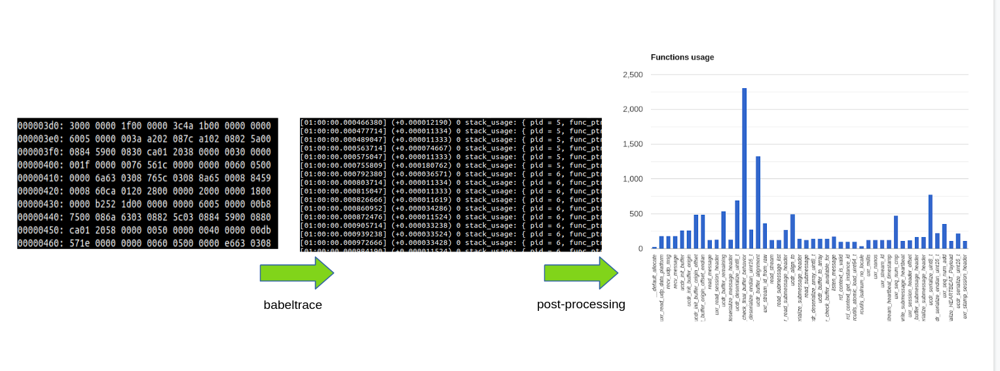
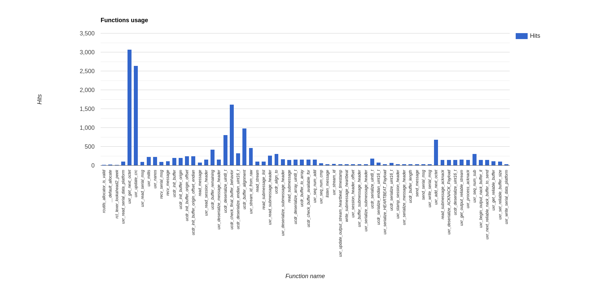
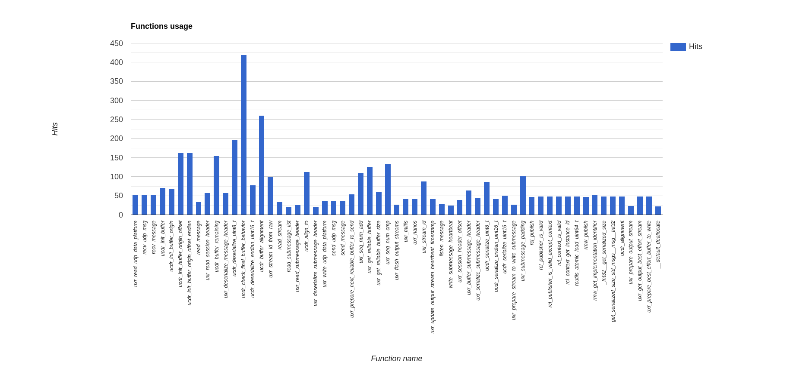
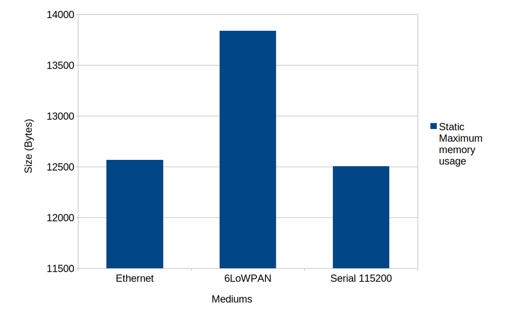
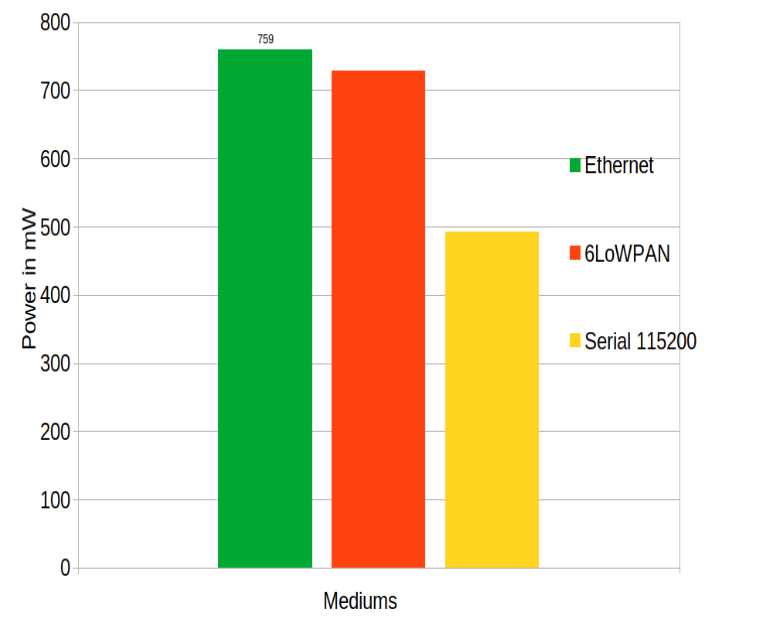

## Table of contents

* [From tracing to benchmarking](#from-tracing-to-benchmarking)
* [Communication results](#communication-results)
* [Real-time results](#real-time-results)
* [Executions](#executions)
* [Function call statistics](#function-call-statistics)
* [Static memory usage](#static-memory-usage)
* [Dynamic memory usage](#dynamic-memory-usage)
* [Power consumption](#power-consumption)

## From tracing to benchmarking

The low-level RTOS (NuutX) was instrumented in a specific way that provides different categories of benchmarking measurements (memory, execution, etc...). The gathered data is following the [Common Trace Format](https://diamon.org/ctf/). The raw trace is later processed using the [Babeltrace API](https://babeltrace.org/) trace manipulation toolkit. The data interpretation is up to the user.

More information about benchmarks results and methodologies are dealt with within the following [document](https://github.com/micro-ROS/benchmarking-results/blob/master/pdfs/OFERA_55_D5.4_Micro-ROS_benchmarks_-_Final.pdf)

The results, on which the interpretation are done, are available in the [benchmarking_results](https://github.com/micro-ROS/benchmarking-results/tree/master/aug2020) repository.

### General methodology

Depending on what type of communication medium micro-ROS is set up with, the methodology may vary. Of course, the variations are small and related to the transport protocol.

In order to achieve benchmarking, the RTOS and the application were instrumented. Depending on the target assessment, different probes were placed in different parts of the RTOS. The data format follows a standard called Common Trace Format (V1.8). This standard is also used in Zephyr, one of the RTOSes supported by the micro-ROS project together with NuttX.
As a matter of fact, the CTF core was ported from Zephyr to NuttX.

Data are retrieved and analysed with babeltrace and the babeltrace python API.

All events are timed using an internal free-running timer (in the case of NuttX running on the Olimex STM32-E407 TIM2). Thanks to this the device can have timer clock offering a resolution of nearly 10 nanoseconds. The current configuration of the resolution is 100 nanoseconds, which is more than enough to assess communication perforances, considering that the minimal Ethernet (64bytes) frame at 100Mbps.
Each measurement is timestamped using the free-running timer mentionned earlier.

The software configuration is likely to change. However the software role will be kept the same:

 * Agent running on a PC
 * Subscriber running on one Olimex STM32-E407,
 * Publisher running on one Olimex STM32-E407.

At a hardware level the USB - CDC/ACM console is going to be used on the Olimex STM32-E407 boards for Ethernet and Serial benchmarkings. For 6LoWPAN the serial USART6 will be used as the console to reduce the memory footprint and execution impact. Hence the USB OTG1 of both Olimex STM32-E407 boards shall be connected to a computer. Additional hardware setup must performed but will depend on the type of topology (Ethernet / Serial / 6LoWPAN):

The results shown below are the fruit of a same application: The **publisher**.
Only the micro-ros related functions were benchmarked. Hence, all the serial/IP/radio configuration parts of the code are benchmarked.

Below the data processing described. From the serialised binary CTF data to the output from the Babeltrace API:

{:.img-responsive and style="max-width: 100%; margin-left: auto; margin-right: auto;"}

## Communication results

Following is the communication bitrate RX/TX:

{:.img-responsive and style="max-width: 100%; margin-left: auto; margin-right: auto;"}


_Observations:_

  According to the data, the Ethernet performs the best, which is expected.

## Real-time results

Following is the execution benchmarking

The data extracted from the Babeltrace show the following about the NuttX scheduler.
The additional information are:

 * The thread_id 0 is the idle thread
 * The thread_id 3 is the low priority work queue (RTOS kthread),
 * The thread_id 7 is the publisher.

```
[01:00:21.445833238] (+0.000009524) 0 thread_resume: { thread_id = 7 }
[01:00:21.445993047] (+0.000159809) 0 thread_suspend: { thread_id = 7 }
[01:00:21.446002761] (+0.000009714) 0 thread_resume: { thread_id = 3 }
[01:00:21.446051904] (+0.000049143) 0 thread_suspend: { thread_id = 3 }
[01:00:21.446061428] (+0.000009524) 0 thread_resume: { thread_id = 0 }
[01:00:21.446085428] (+0.000024000) 0 thread_suspend: { thread_id = 0 }
[01:00:21.446095428] (+0.000010000) 0 thread_resume: { thread_id = 3 }
[01:00:21.446133047] (+0.000037619) 0 thread_suspend: { thread_id = 3 }
[01:00:21.446142571] (+0.000009524) 0 thread_resume: { thread_id = 0 }
[01:00:21.446273523] (+0.000130952) 0 thread_suspend: { thread_id = 0 }
[01:00:21.446283523] (+0.000010000) 0 thread_resume: { thread_id = 3 }
[01:00:21.446335809] (+0.000052286) 0 thread_suspend: { thread_id = 3 }
[01:00:21.446345333] (+0.000009524) 0 thread_resume: { thread_id = 7 }
[01:00:21.446505333] (+0.000160000) 0 thread_suspend: { thread_id = 7 }
[01:00:21.446514952] (+0.000009619) 0 thread_resume: { thread_id = 3 }
[01:00:21.446564190] (+0.000049238) 0 thread_suspend: { thread_id = 3 }
[01:00:21.446573714] (+0.000009524) 0 thread_resume: { thread_id = 0 }
[01:00:21.446597714] (+0.000024000) 0 thread_suspend: { thread_id = 0 }
[01:00:21.446607714] (+0.000010000) 0 thread_resume: { thread_id = 3 }
[01:00:21.446645333] (+0.000037619) 0 thread_suspend: { thread_id = 3 }
[01:00:21.446654857] (+0.000009524) 0 thread_resume: { thread_id = 0 }
[01:00:21.446779047] (+0.000124190) 0 thread_suspend: { thread_id = 0 }
[01:00:21.446789142] (+0.000010095) 0 thread_resume: { thread_id = 3 }
[01:00:21.446841333] (+0.000052191) 0 thread_suspend: { thread_id = 3 }
[01:00:21.446850857] (+0.000009524) 0 thread_resume: { thread_id = 7 }
[01:00:21.447010571] (+0.000159714) 0 thread_suspend: { thread_id = 7 }
[01:00:21.447020285] (+0.000009714) 0 thread_resume: { thread_id = 3 }
```

_Observations:_

According to the results taken above, the software is running a deterministic way. Indeed, by looking closer, it is noticeable that the running sequence is the same.

Additionally, timing deltas between correlated events have a really low variation when switch (consecutive thread_suspend/thread_resume).

Moreover, the scheduler performs fast context switches, on average the are around 10 microseconds.

## Executions

Following is depicted the execution benchmarking. The amount of time spend on the CPU split into two parts (I/O operations, Subscriber operations):

{:.img-responsive and style="max-width: 100%; margin-left: auto; margin-right: auto;"}


_Observations:_
    According to the data, most of the time was spent during I/O operations.

## Function call statistics

Below are depicted the function calls count per each communication medium:

**Ethernet**
{:.img-responsive and style="max-width: 100%; margin-left: auto; margin-right: auto;"}

**Serial**
{:.img-responsive and style="max-width: 100%; margin-left: auto; margin-right: auto;"}

**6LoWPAN**
 {:.img-responsive and style="max-width: 100%; margin-left: auto; margin-right: auto;"}

## Static memory usage

Below is the representation of the static memory analysis:

{:.img-responsive and style="max-width: 100%; margin-left: auto; margin-right: auto;"}

_Observations:_

The 6LoWPAN is the medium consuming most of the static memory as this protocol is running on top of IP version 6.

## Dynamic memory usage

The graphic below is showing the total number dynamic allocations. Each bin is split into group of chunk memory blocks. In each group lies different chunk sizes. The size of each group are comprise between a minimum size, which is the size of the previous group. And a maximum size, which is the size display in the legend.
For instance a block with the legend colored yellow represents all block that are greater than the previous group of chunk memory, here 16 bytes. But that the are lower or equal to 32 bytes.

{:.img-responsive and style="max-width: 100%; margin-left: auto; margin-right: auto;"}

_Observations:_

Independently from the communication mediums, blocks allocated are not huge and not numerous.
The most of the allocations are happening during initialisation.


## Power consumption

Below is depicted energy consumption categorised by communication medium below:

{:.img-responsive and style="max-width: 100%; margin-left: auto; margin-right: auto;"}

_Observations:_

The communication medium has a high impact on the throughput, which in turn has an impact on the power consumption. The Ethernet provides a high throughput, but at the price of a higher power consumption. In comparison, the serial communciation medium provides a low bitrate with the advantage to consuming a lot less energy.
