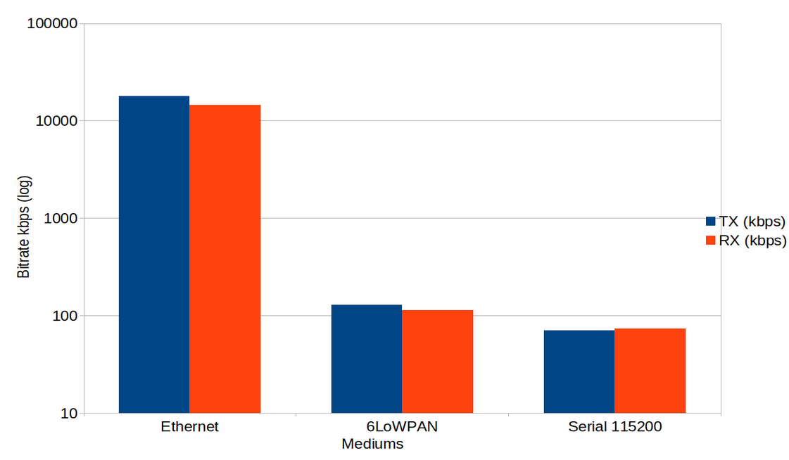
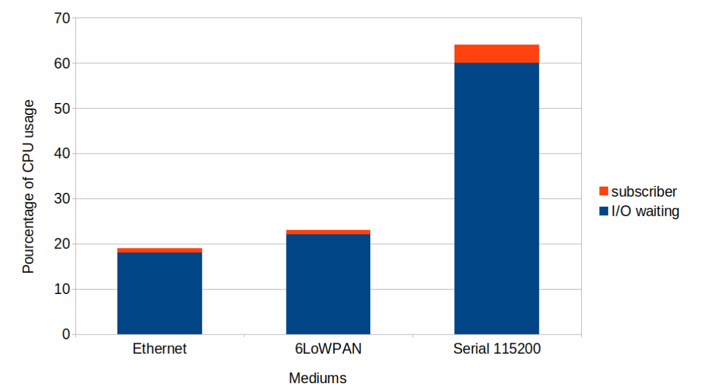
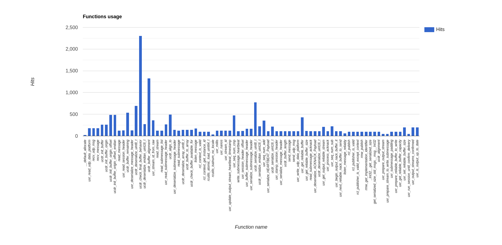
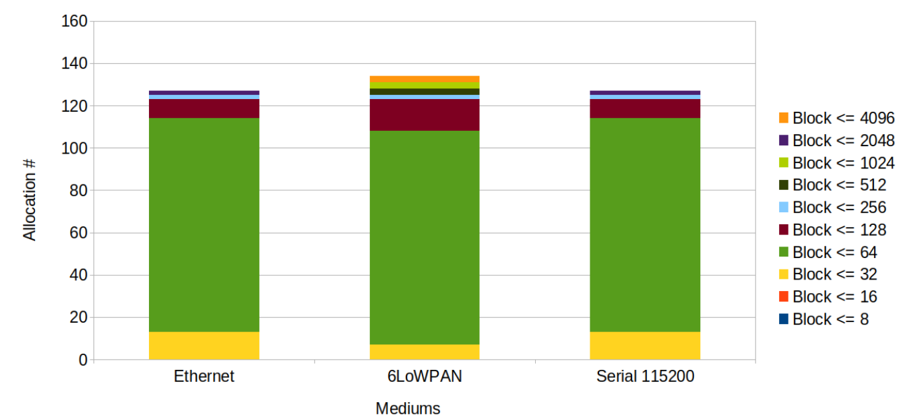

## Table of contents

* [From tracing to benchmarking](#from-tracing-to-benchmarking)
* [Communication results](#communication-results)
* [Real-time results](#real-time-results)
* [Executions](#executions)
* [Function execution usage](#function-execution-usage)
* [Static memory usage](#static-memory-usage)
* [Dynamic memory usage](#dynamic-memory-usage)
* [Power consumption](#power-consumption)

## From tracing to benchmarking

The low-level RTOS was instrumented in specific way that provide different categories of benchmarking results (memory, execution, etc...). The gathered data is following the [Common Trace Format](https://diamon.org/ctf/). The Trace is later exploited using the [Babeltrace API](https://babeltrace.org/)trace manipulation toolkit. The data interpretation is up to the user.

More information about benchmarks results and methodologies are dealt with within the following document (TODO link to the deliverable).

The results, on which the interpretation are done, are available in the [benchmarking_results](https://github.com/micro-ROS/benchmarking-results/tree/master/aug2020) repository.


{:.img-responsive and style="max-width: 100%; margin-left: auto; margin-right: auto;"}

## Communication results

Following is the communication bitrate RX/TX:

{:.img-responsive and style="max-width: 100%; margin-left: auto; margin-right: auto;"}


_Observations:_

  According to the data, the Ethernet performs the best, which is expected.

## Real-time results

Following is the execution benchmarking

The data extracted from the Babeltrace show the following about the NuttX scheduler.
The additional information are:

 * The thread_id 0 is the idle thread
 * The thread_id 3 is the low priority work queue (RTOS kthread),
 * The thread_id 7 is the publisher.

```
[01:00:21.445833238] (+0.000009524) 0 thread_resume: { thread_id = 7 }
[01:00:21.445993047] (+0.000159809) 0 thread_suspend: { thread_id = 7 }
[01:00:21.446002761] (+0.000009714) 0 thread_resume: { thread_id = 3 }
[01:00:21.446051904] (+0.000049143) 0 thread_suspend: { thread_id = 3 }
[01:00:21.446061428] (+0.000009524) 0 thread_resume: { thread_id = 0 }
[01:00:21.446085428] (+0.000024000) 0 thread_suspend: { thread_id = 0 }
[01:00:21.446095428] (+0.000010000) 0 thread_resume: { thread_id = 3 }
[01:00:21.446133047] (+0.000037619) 0 thread_suspend: { thread_id = 3 }
[01:00:21.446142571] (+0.000009524) 0 thread_resume: { thread_id = 0 }
[01:00:21.446273523] (+0.000130952) 0 thread_suspend: { thread_id = 0 }
[01:00:21.446283523] (+0.000010000) 0 thread_resume: { thread_id = 3 }
[01:00:21.446335809] (+0.000052286) 0 thread_suspend: { thread_id = 3 }
[01:00:21.446345333] (+0.000009524) 0 thread_resume: { thread_id = 7 }
[01:00:21.446505333] (+0.000160000) 0 thread_suspend: { thread_id = 7 }
[01:00:21.446514952] (+0.000009619) 0 thread_resume: { thread_id = 3 }
[01:00:21.446564190] (+0.000049238) 0 thread_suspend: { thread_id = 3 }
[01:00:21.446573714] (+0.000009524) 0 thread_resume: { thread_id = 0 }
[01:00:21.446597714] (+0.000024000) 0 thread_suspend: { thread_id = 0 }
[01:00:21.446607714] (+0.000010000) 0 thread_resume: { thread_id = 3 }
[01:00:21.446645333] (+0.000037619) 0 thread_suspend: { thread_id = 3 }
[01:00:21.446654857] (+0.000009524) 0 thread_resume: { thread_id = 0 }
[01:00:21.446779047] (+0.000124190) 0 thread_suspend: { thread_id = 0 }
[01:00:21.446789142] (+0.000010095) 0 thread_resume: { thread_id = 3 }
[01:00:21.446841333] (+0.000052191) 0 thread_suspend: { thread_id = 3 }
[01:00:21.446850857] (+0.000009524) 0 thread_resume: { thread_id = 7 }
[01:00:21.447010571] (+0.000159714) 0 thread_suspend: { thread_id = 7 }
[01:00:21.447020285] (+0.000009714) 0 thread_resume: { thread_id = 3 }
```

_Observations:_

According to the results taken above, the software is running a deterministic way. Indeed, by looking closer, it is noticeable that the running sequence is the same.

Additionally, timing deltas between correlated events have a really low variation when switch (consecutive thread_suspend/thread_resume).

Moreover, the scheduler performs fast context switches, on average the are around 10 microseconds.

## Executions

Following is depicted the execution benchmarking. The amount of time spend on the CPU split into two parts (I/O operations, Subscriber operations):

{:.img-responsive and style="max-width: 100%; margin-left: auto; margin-right: auto;"}


_Observations:_
    According to the data, most of the time was spent during I/O operations.

## Function execution usage

Below are depicted the function calls count per each communication medium:

**Ethernet**
{:.img-responsive and style="max-width: 100%; margin-left: auto; margin-right: auto;"}

**Serial**
{:.img-responsive and style="max-width: 100%; margin-left: auto; margin-right: auto;"}

**6LoWPAN**
 {:.img-responsive and style="max-width: 100%; margin-left: auto; margin-right: auto;"}

## Static memory usage

Below is the representation of the static memory analysis:

{:.img-responsive and style="max-width: 100%; margin-left: auto; margin-right: auto;"}

_Observations:_

The 6LoWPAN is the medium taking the most of the static memory as this protocol is running on top of IP version 6.

## Dynamic memory usage

The graphic below is showing the total number dynamic allocations. Each bin is split into group of chunk memory blocks. For instance a block with the legend colored dark green represents all block that are greater than the previous group of chunk memory, here 16 bytes. But that the are lower or equal to 32 bytes):

{:.img-responsive and style="max-width: 100%; margin-left: auto; margin-right: auto;"}

_Observations:_

Independently on the communication mediums, blocks allocated are not huge and not numerous.
The most of the allocations are happening during initialisation.


## Power consumption

The power consumption categorised by communication medium below:

{:.img-responsive and style="max-width: 100%; margin-left: auto; margin-right: auto;"}

_Observations:_

The medium has a high impact on the selection of the communication medium. This high throughput of a communication medium is coming at a price:  power consumption. The Ethernet provided a hight throughput at the price of a higher power consumption. Whereas, the serial is provide a low bitrate with the advantage to consume a lot less energy.