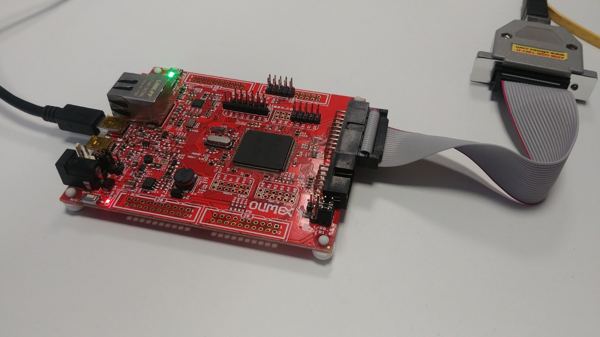
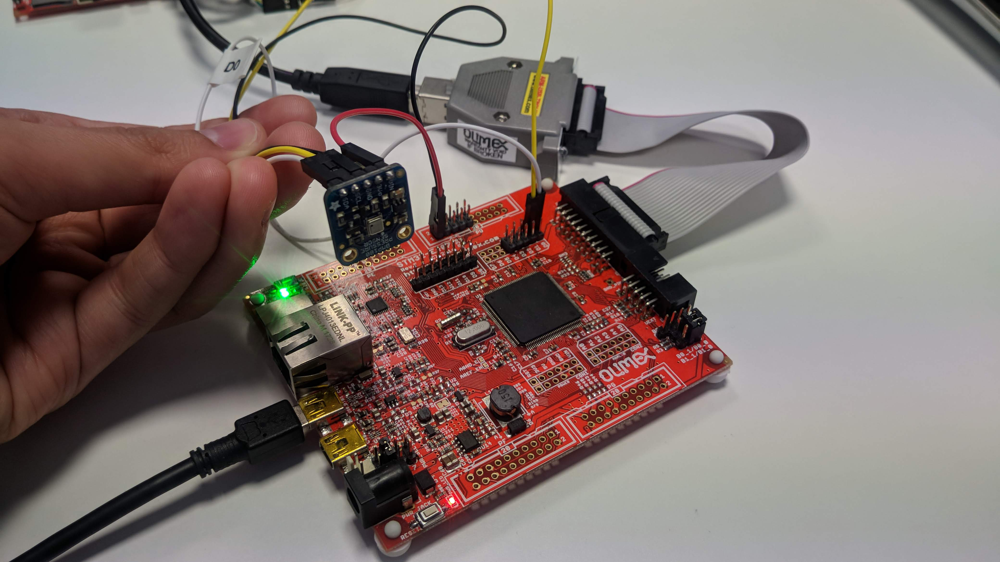
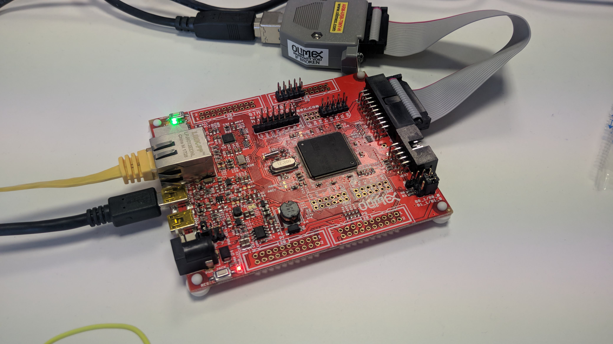
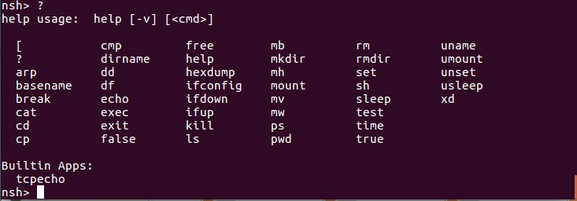
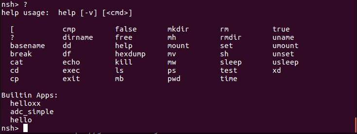
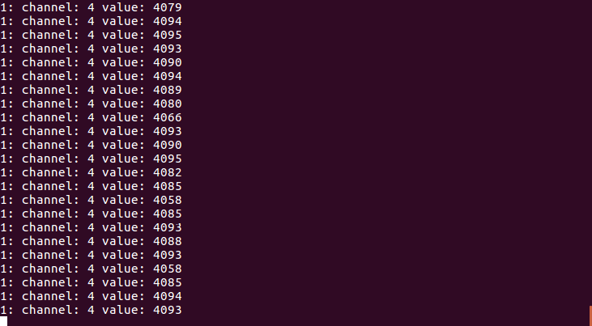
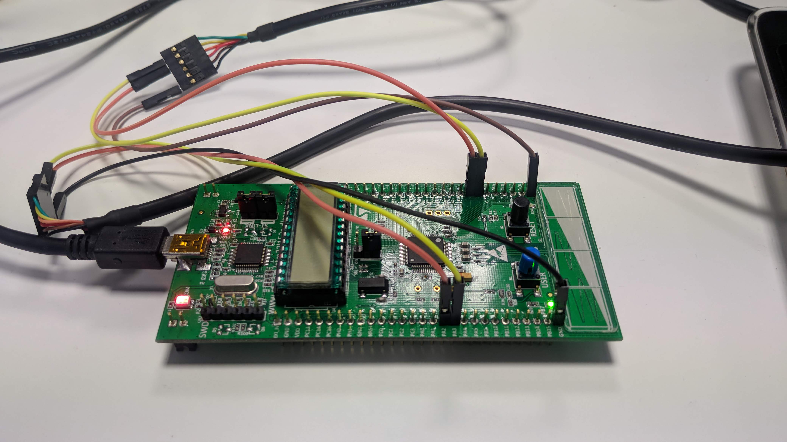
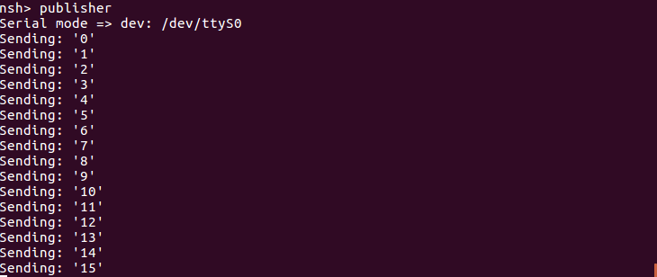
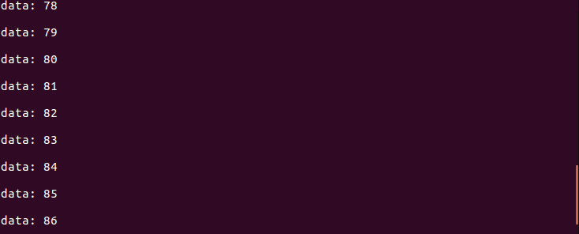

This document wants to be a small guideline for rapidly start using
the defconfig files for NuttX, OFERA project has created.

# Example list


## Olimex STM32-E407

- [NSH over USB](#How-to-execute-NSH-over-USB-under-Olimex-STM32-E407)
- [NSH over UART](#How-to-use-NSH-over-UART)
- [Auxiliar UART port](#How-to-use-an-auxiliary-UART)
- [BMP180 through I2C](#How-to-execute-BMP180-example)
- [HIH6130 through I2C](#How-to-execute-HIH6130-example)
- [UDP echo server](#How-to-execute-UDPEcho-server-example)
- [TCP echo server](#How-to-execute-TCP-Echo-server-example)
- [MRF24J40-6LowPan through SPI](#How-to-use-MRF24j40-6LowPan)
- [ADC](#How-to-use-the-ADC-demo)
- [Telemetry](#How-to-execute-telemetry-app)
- [Power Manager](#How-to-execute-Power-Manager-example)
- [SD Card](#How-to-use-a-micro-SD-Card-in-the-Olimex-STM32-E407-board)
- [Micro XRCE-DDS through serial](#How-to-execute-Micro-XRCE-DDS)
- [micro-ROS demo](#How-to-use-micro-ROS-demo)


## STM32L Discovery

- [NSH through UART](#How-to-execute-NSH-under-STM32L-Discovery)
- [BMP180 through I2C](#How-to-execute-BMP180-example)
- [HIH6130 through I2C](#How-to-execute-HIH6130-example)
- [Power Manager](#How-to-execute-Power-Manager-example)
- [Micro XRCE-DDS through serial](#How-to-execute-Micro-XRCE-DDS)


# Repositories to be used

For the examples listed below, please make use of the branch called `master` for this two repositories:

-  [NuttX](https://github.com/microROS/Nuttx) fork, where NuttX RTOS is stored.
-  [Apps](https://github.com/microROS/apps) fork, whee NuttX applications and examples are placed.

----------------------

# How to configure and flash a board

We have developed two scripts that will help you to configure and flash the board. Go to the `NuttX` folder and write the next commands:

- To configure: `$ ./scripts/configure.sh <board_model> <example_to_set>`
- To compile: `make`
- To flash: `./scripts/flash.sh <board_model>`, where the script expects `olimex-stm32-e407` or `stm32l1`.

The configuration script will clean the previous project and set the new configuration.

The flash script will execute the proper command to upload the firmware to the board and execute it. The use of `OpenOCD` gives you the chance to debug the MCU.

# Step-by-step tutorials

This section provides step-by-step tutorials so you can start executing the examples we have created. These tutorials starts using NuttX, using many different peripherals and tools, and ends up showing how to execute Micro XRCE-DDS client and micro-ROS client.

## How to execute NSH over USB under Olimex-STM32-E407

NSH is a system console that can be use throught the next interfaces: USB,UART and Telnet. With this console you can execute apps, set system configuration and see the state of the system.

Go to the main folder of NuttX and execute the next command to configure the board:
`./scripts/configure.sh olimex-stm32-e407 nsh`

This script will clean NuttX and set the configuration that we need. You should see something like this at the end of process at the terminal.

```
  Copy files
  Refreshing...
```

Once the board is configured, the next step will be to compile the firmware:
Type `make` and you should see something like this when it finishes in the terminal:
```
CP: nuttx.hex
CP: nuttx.bin
```

Now it's ready for uploading the firmware into the board, so plug the micro USB cable an type the next command:
`./scripts/flash.sh olimex-stm32-e407`

If everything goes right, the loader will return the next message:
```
wrote 49152 bytes from file nuttx.bin in 6.279262s (7.644 KiB/s)
Info : Listening on port 6666 for tcl connections
Info : Listening on port 4444 for telnet connections
```

Connect the mini USB cable to the USB OTG1



Open a new terminal and use a serial client, i.e. `minicom` to open the serial port, `sudo minicom -D /dev/ttyACM0`. Once done, you should be able to see how `NSH` pops up when pressing key:

```
nsh>
nsh>
nsh>
nsh> ?
help usage:  help [-v] [<cmd>]

  ?           exec        hexdump     mb          sleep       
  cat         exit        kill        mh          usleep      
  echo        help        ls          mw          xd          

Builtin Apps:
nsh>
```
If you don't know which interface is the micro USB, type `dmesg` command at a terminal, this command should let you know which is the last USB device that has been connected to your computer and at what interface is attached.

## How to execute NSH with the UART.


### Olimex-STM32-E407
This board have the possibility to show the console through the UART or through USB.

Go to the main folder of NuttX and execute the next command to configure the board:
`./scripts/configure.sh olimex-stm32-e407 nsh_uart`

This script will clean NuttX and set the configuration that we need. You should see something like this at the end of process at the terminal.

```
  Copy files
  Refreshing...
```
Once the board is configured, the next step will be to compile the firmware:
Type `make` and you should see something like this when it finishes in the terminal:
```
CP: nuttx.hex
CP: nuttx.bin
```
Now it's ready for uploading the firmware into the board, so plug the micro USB cable an type the next command:
`./scripts/flash.sh olimex-stm32-e407`

If everything goes right, the loader will return the next message:
```
wrote 49152 bytes from file nuttx.bin in 6.279262s (7.644 KiB/s)
Info : Listening on port 6666 for tcl connections
Info : Listening on port 4444 for telnet connections
```
For this demo we need to connect a USB cable to the mini USB port and a serial cable (TTL232) to the UART3 with the next pinout:

- `USART3 TX` -> `TTL232 RX`
- `USART3 RX` -> `TTL232 TX`
- `GND Board` -> `TTL232 GND`

It should look like this:


Open a new terminal and use a serial client, i.e. `minicom` to open the serial port, `sudo minicom -D /dev/ttyUSB0`. Once done, you should be able to see how `NSH` pops up when pressing key:

```
nsh>
nsh>
nsh>
nsh> ?
help usage:  help [-v] [<cmd>]

  ?           exec        hexdump     mb          sleep       
  cat         exit        kill        mh          usleep      
  echo        help        ls          mw          xd          

Builtin Apps:
nsh>
```


### STM32L1Discovery
**This board only can show the NSH console throught the UART**

Go to the main folder of NuttX and execute the next command to configure the board:
`./scripts/configure.sh stm32l1 nsh`

This script will clean NuttX and set the configuration that we need. You should see something like this at the end of process at the terminal.

```
  Copy files
  Refreshing...
```

Once the board is configured, the next step will be to compile the firmware:
Type `make` and you should see something like this when it finishes in the terminal:
```
CP: nuttx.hex
CP: nuttx.bin
```

Now it's ready for uploading the firmware into the board, so plug the micro USB cable an type the next command:
`./scripts/flash.sh stm32l1`

If everything goes right, the loader will return the next message:
```
wrote 49152 bytes from file nuttx.bin in 6.279262s (7.644 KiB/s)
Info : Listening on port 6666 for tcl connections
Info : Listening on port 4444 for telnet connections
```

Connect the serial cable `RX` to pin `PA9` and `TX` to pin `PA10` and the GND wire to a `GND` pin.


Open a new terminal and use a serial client, i.e. `minicom` to open the serial port, `sudo minicom -D /dev/ttyUSB0`. Once done, you should be able to see how `NSH` pops up when pressing key:

```
nsh>
nsh>
nsh>
nsh> ?
help usage:  help [-v] [<cmd>]

  ?           exec        hexdump     mb          sleep       
  cat         exit        kill        mh          usleep      
  echo        help        ls          mw          xd          

Builtin Apps:
nsh>
```
If you don't know which interface is the micro USB, type `dmesg` command at a terminal, this command should let you know which is the last USB device that has been connected to your computer and at what interface is attached.

## How to use an auxiliary UART:

In this demo we will show how to use an auxiliary UART to send and receive messages.
When we run this demos, we will send the first argument to the auxiliary terminal and we will wait for an input from the auxiliary terminal.

*Note: The STM32L1Discovery board can use a auxiliary port, but the application it's not compatible.*

You need to configure, compile and upload the firmware, so execute the next commands:
- `./scripts/configure.sh olimex-stm32-e407 aux_serial`
- `make`
- `./scripts/flash.sh olimex-stm32-e407`

For this demo we need to connect a USB cable to the mini USB port and a serial cable (TTL232) to the UART3 with the next pinout:

- `USART3 TX` -> `TTL232 RX`
- `USART3 RX` -> `TTL232 TX`
- `GND Board` -> `TTL232 GND`

And it should look like this:


Start the board, find which is the port of the auxiliary serial cable and open a terminal in that port. Init the application `aux_serial <message_to_send>`.

The message will appear in the other terminal and you need to push any key in the terminal to unlock the board console. This image is the board console:


This image is the auxiliary console:


## How to execute BMP180 example

BMP180 is a I2C barometric pressure sensor. With this sensor you can obtain the atmospheric pressure and with that data you can calculate the altitude.


[BMP180 breakout link](https://www.adafruit.com/product/1603)

### Olimex STM32-E407

Go to the main folder of NuttX and type the command to configure the board:
`./scripts/configure.sh olimex-stm32-e407 bmp180`

Compile:
`make`

Upload:
`./scripts/flash.sh olimex-stm32-e407`

### STM32L Discovery

Go to the main folder of NuttX and type the command to configure the board:
`./scripts/configure.sh stm32l1 bmp180`

Compile:
`make`

Upload the firmware:
`./scripts/flash.sh stm32l1`

In both cases it should return somenthing like this:

- Configuration:
```
Copy files
Refreshing...
```
- Compilation:
```
CP: nuttx.hex
CP: nuttx.bin
```
- Upload the firmware
```
wrote 131072 bytes from file nuttx.bin in 3.763846s (34.008 KiB/s)
Info : Listening on port 6666 for tcl connections
Info : Listening on port 4444 for telnet connections
```
(The number of writen bytes could be different in each board)


###  Olimex

Connect the sensor, as in the next image:



### STM32L Discovery

Place Serial debugger `RX` to pin `PA10`, `TX`to `PA9` and `GND` to `GND , and connect the sensor `Vin` to `EXT_5V`, `GND` to `GND`, `SCL` to `PB9` and `SDA` to `PB8` (Board pin names are specified in silkscreen). For feeding the sensor, use the `EXT_5V` pin. Like in the image below:


In a new terminal, open a serial session attached to your serial cable. Once you have done it, press "RESET" button. You should see NuttX console popping up:

```
NuttShell (NSH)                                                                 
nsh>
```
Now type `?`  command for checking if the example binary is available:

```
nsh> ?                                                                          
help usage:  help [-v] [<cmd>]                                                  

 [           cmp         false       mkdir       rm          true              
 ?           dirname     free        mh          rmdir       uname             
 basename    dd          help        mount       set         umount            
 break       df          hexdump     mv          sh          unset             
 cat         echo        kill        mw          sleep       usleep            
 cd          exec        ls          ps          test        xd                
 cp          exit        mb          pwd         time                          

Builtin Apps:                                                                   
 adc_simple                                                                    
 hello                                                                         
 helloxx                                                                       
 bmp180
```

Now, execute the example:

`nsh>bmp180`

This is the expected outoput:
```
Pressure: 95988                                                                 
Pressure: 95987                                                                 
Pressure: 95987                                                                 
Pressure: 95985                                                                 
Pressure: 95988
```

## How to execute HIH6130 example

The HIH6130 is humidity/temperature that works through I2C interface.


[HIH6130 breakout link](https://www.sparkfun.com/products/11295)

Go to the main folder of NuttX and type the command to configure the board:
`./scripts/configure.sh olimex-stm32-e407 hih6130`

Compile:
`make`

Upload:
`./scripts/flash.sh olimex-stm32-e407`

### STM32L Discovery

Go to the main folder of NuttX and type the command to configure the board:
`./scripts/configure.sh stm32l1 hih6130`

Compile:
`make`

Upload the firmware:
`./scripts/flash.sh stm32l1`

In both cases, it should return at the end something like this:
- Configuration:
```
Copy files
Refreshing...
```
- Compilation:
```
CP: nuttx.hex
CP: nuttx.bin
```
- Upload the firmware
```
wrote 131072 bytes from file nuttx.bin in 3.763846s (34.008 KiB/s)
Info : Listening on port 6666 for tcl connections
Info : Listening on port 4444 for telnet connections
```
(The number of writen bytes could be different in each board)

### Hardware connection

### Olimex

Connect the sensor as in the following image:


Sensor `SDA` to `CON3` header `D0` pin
Sensor `SCL` to `CON3` header `D1` pin

Sensor `VIN` to `PD` header `19` pin
Sensor `GND` to `PD` header `20` pin

### STM32L Discovery

Connect the sensor as in the following image:


Place the serial debugger `RX`to `PA10`, `TX`to `PA9` and `GND` to `GNDb, and connect the sensor `Vin` to `EXT_5V`, `GND` to `GND`, `SCL` to `PB9` and `SDA` to `PB8` (Board pin names are specified in the silkscreen). For feeding the  sensor use the `EXT_5V` pin.

In a new terminal, open a serial session attached to your serial cable, once you have done it, press "RESET" button. You should see NuttX console popping up:

```
NuttShell (NSH)                                                                 
nsh>
```
Now type `?`  command for checking if the example binary is there:

```
nsh> ?                                                                          
help usage:  help [-v] [<cmd>]                                                  

 [           cmp         false       mkdir       rm          true              
 ?           dirname     free        mh          rmdir       uname             
 basename    dd          help        mount       set         umount            
 break       df          hexdump     mv          sh          unset             
 cat         echo        kill        mw          sleep       usleep            
 cd          exec        ls          ps          test        xd                
 cp          exit        mb          pwd         time                          

Builtin Apps:                                                                   
 adc_simple                                                                    
 hello                                                                         
 helloxx                                                                       
 hih6130
```

Now, execute the example:

`nsh>hih6130`
This is the expected outoput:
```
nsh> hih6130                                                                    
Temperature: 31 �ºC Humidity: 49                                                
Temperature: 31 �ºC Humidity: 45                                                
Temperature: 31 �ºC Humidity: 44                                                
Temperature: 31 �ºC Humidity: 44
```

## How to execute UDP Echo server example

Go to the main folder of NuttX and type the next command to configure the board:
`./scripts/configure.sh olimex-stm32-e407 udpecho`

Compile:
`make`

Upload:
`./scripts/flash.sh olimex-stm32-e407`

This print the next:

- Configuration:
```
Copy files
Refreshing...
```
- Compilation:
```
CP: nuttx.hex
CP: nuttx.bin
```
- Upload the firmware
```
wrote 131072 bytes from file nuttx.bin in 3.763846s (34.008 KiB/s)
Info : Listening on port 6666 for tcl connections
Info : Listening on port 4444 for telnet connections
```

Once the code it's uploaded to the board, do the next:
- Connect the ethernet cable to the ethernet port of the board.
- Connect the mini USB cable to the USB_OTG 1 port.





- Configure the console with a baud rate of 115200 bauds.
- Once you open the console, you should check if the app was correctly upload typing `?`. You should see the next:


- Then type `ifup eth0` to bring up the network:


- Mount the file system of NuttX typing `mount -t procfs /proc`
- See which IP was assigned to your board typing `ifconfig` and you should see this:


With this command, you can see statistics of the network, the IP of the board, the state of the connection...
In this case the IP that was assigned was the 192.168.1.35
**By default this board will use the port 80.** To change it, you must do it in the app's code.

- The last step in the board side is to type `udpecho` to run the udp echo server.
-Then in the computer side, use `netcat` command.  Type the next command: `netcat -u 192.168.1.35 80`

Now if you type something in the computer, the board should echo the same and show the data of the messages, like in the image:

**Computer side**


**Board side**


## How to execute TCP Echo server example


Go to the main folder of NuttX and type the next command to configure the board:
`./scripts/configure.sh olimex-stm32-e407 tcpecho`

Compile:
`make`

Upload:
`./scripts/flash.sh olimex-stm32-e407`

This should be the result:

- Configuration:
```
Copy files
Refreshing...
```
- Compilation:
```
CP: nuttx.hex
CP: nuttx.bin
```
- Upload the firmware
```
wrote 131072 bytes from file nuttx.bin in 3.763846s (34.008 KiB/s)
Info : Listening on port 6666 for tcl connections
Info : Listening on port 4444 for telnet connections
```

Once the code it's uploaded to the board, do the next steps:
- Connect the ethernet cable to the ethernet port of the board.
- Connect the mini USB cable to the USB_OTG 1 port.

*Note:This example has been made using router in the middle of the computer and the Olimex board.*

Once you reset the board, it should appear the NSH console and, if you type  `?`, you should see the `tcpecho` application.



You need to bring up the network:


Type `ifconfig` and you will see the IP.


Finally execute the app, it should return the next:
```
Start Echo Server

```

Then, in your computer, you can open an TCP/IP client with the next command in the console:
` netcat -t 192.168.1.133 80`

This command connects to the IP 192.168.1.133 and to the port 80

Now wright some characters in the terminal:

```
~$ netcat -t 192.168.1.133 80
sfd
sfd
aaa
aaa
jjj
jjj
```

At the client, in your computer, you should see the reply of what you're writing.

If you want to check or modify the connection data, you can do it in the next path:
`make menuconfig`

`Application configuration`

`Examples`

And you will see something like this:


This shows the IP direction, the netmask and the router IP in hexadecimal format and the port to connect.

The variables are shown in two hexadecimal numbers per each field. In case of the IP:
`0xCA` = 192

`0xA8` = 168

`0x01` = 1

`0x85` = 133


## How to use MRF24j40-6LowPan

With this demo, we'll be able to create a point to point connection with the  MRF24J40 module using the protocol 6LowPan. This network, allows you to have hundreds of nodes with very little power consumption.
One of the nodes is a TCP or UDP server, and the other nodes are TCP or UDP clients that they connect to the server.


[mrf24j40 breakout link](https://store.digilentinc.com/pmod-rf2-ieee-802-15-rf-transceiver/)

Go to the main folder of NuttX and type the command to configure the board:
`./scripts/configure.sh olimex-stm32-e407 mrf24j40-6lowpan`

Compile:
`make`

Upload:
`./scripts/flash.sh olimex-stm32-e407`

It should return somenthing like this:

- Configuration:
```
Copy files
Refreshing...
```
- Compilation:
```
CP: nuttx.hex
CP: nuttx.bin
```
- Upload the firmware
```
wrote 131072 bytes from file nuttx.bin in 3.763846s (34.008 KiB/s)
Info : Listening on port 6666 for tcl connections
Info : Listening on port 4444 for telnet connections
```
(The number of written bytes could be different in each board)

Once the firmware was configured and uploaded, we need to connect the breakout board like this:
- `Board D13` -> `MRF24J40 SCLK`
- `Board D12` -> `MRF24J40 MISO`
- `Board D11` -> `MRF24J40 MOSI`
- `Board D10` -> `MRF24J40 CS`
- `Board D8` -> `MRF24J40 INT`

Finally, connect the mini USB cable to the USB OTG1, and the connections should look like this:


Once the wiring is done, open a console and you should see this:

```bash
nsh> ?
help usage:  help [-v] [<cmd>]

  [         cd        df        help      ls        mw        set       true      
  ?         cp        echo      hexdump   mb        ps        sh        uname     
  addroute  cmp       exec      ifconfig  mkdir     pwd       sleep     umount    
  basename  dirname   exit      ifdown    mh        rm        test      unset     
  break     dd        false     ifup      mount     rmdir     telnetd   usleep    
  cat       delroute  free      kill      mv        route     time      xd        

Builtin Apps:
  udp_6lowpan  ping6        i8sak
```

Execute the App ``udp_6lowpan``.
When you execute it, the app will ask you if you want to do an auto-configuration.
The first time that we execute this app after the initialization of the board, we need to configure the network. If you execute the autoconfiguration, the configuration process will be simplified, otherwise, you will need to configure manually. **If you don't configure the board, it won't work properly.**
If you type 'Y', it should appear the next output:

```bash
nsh> udp_6lowpan
Do you want to execute the automatic WPAN configuration? (y/n)
Starting WPAN configuration
Type C to be coordinator
Type N to be node

```

This is asking if you want to be a coordinator or a node.
The difference between a coordinator and a node is that the first one can work as a router, coordinating the network traffic of up to 8 nodes.
On the other hand, the node is an endpoint device which only sends and receive data, it doesn't coordinate the traffic of the other devices.

**Note:** A coordinator should be bring-up before the node configuration.

If you choose coordinator, type 'C' and it should return the next output:

```bash
ifdown wpan0...OK
i8sak: resetting MAC layer
i8sak: starting PAN
Choose your ID (00 to FF)
```
Type the ID that you want, it should be between 00 and FF (Hexadecimal value).
**Caution:** Avoid to use the same ID in two devices,or you will get and IP conflict.The ID must be unique.

Once you write your ID, it should return the next data:
```bash
Your hardware address is: i8sak set eaddr 00:fa:de:00:de:ad:be:00

i8sak: accepting all assoc requests
i8sak: daemon started
ifup wpan0...OK
Mounting proc file system
wpan0   Link encap:6LoWPAN HWaddr 00:be:ad:de:00:de:fa:00 at UP
        inet6 addr: fe80::2be:adde:de:fa00/64
        inet6 DRaddr: ::/64

        RX: Received Fragment Errors  
            00000000 00000000 00000000
            IPv6     Dropped
            00000000 00000000
        TX: Queued   Sent     Errors   Timeouts
            00000000 00000000 00000000 00000000
        Total Errors: 00000000


Available commands
 -To send a package type: write
 -To receive a package type: read
 -To exit type: quit

```

Now the coordinator network is ready to send and receive packages. Also is prepared to receive an association request from the nodes. This association request is a tool of node to be coordinated by a coordinator.

Coming back to the role menu, if you choose a node, will also ask for an ID (**Remember, the ID must be unique.**). And it should look like this:

```bash
nsh> udp_6lowpan
Do you want to execute the automatic WPAN configuration? (y/n)
Starting WPAN configuration
Type C to be coordinator
Type N to be node


ifdown wpan0...OK
Choose your ID (00 to FF)

```
The node can send and receive a message with and without a coordinator. After giving a valid ID, we can have the next two output:

- If a coordinator is available in the network:

```bash
Your hardware address is: i8sak set eaddr 00:fa:de:00:de:ad:be:01

i8sak: daemon started
i8sak: issuing ASSOC. request 1
i8sak: ASSOC.request succeeded
ifup wpan0...OK
Mounting proc file system
i8sak: daemon closing
wpan0   Link encap:6LoWPAN HWaddr 01:be:ad:de:00:de:fa:00 at UP
        inet6 addr: fe80::3be:adde:de:fa00/64
        inet6 DRaddr: ::/64

        RX: Received Fragment Errors  
            00000000 00000000 00000000
            IPv6     Dropped
            00000000 00000000
        TX: Queued   Sent     Errors   Timeouts
            00000000 00000000 00000000 00000000
        Total Errors: 00000000


Available commands
 -To send a package type: write
 -To receive a package type: read
 -To exit type: quit

```
- No coordinator is available:

```bash
Your hardware address is: i8sak set eaddr 00:fa:de:00:de:ad:be:01

i8sak: daemon started
i8sak: issuing ASSOC. request 1
i8sak: ASSOC.request failed: No ack
ifup wpan0...OK
Mounting proc file system
i8sak: daemon closing
wpan0   Link encap:6LoWPAN HWaddr 01:be:ad:de:00:de:fa:00 at UP
        inet6 addr: fe80::3be:adde:de:fa00/64
        inet6 DRaddr: ::/64

        RX: Received Fragment Errors  
            00000000 00000000 00000000
            IPv6     Dropped
            00000000 00000000
        TX: Queued   Sent     Errors   Timeouts
            00000000 00000000 00000000 00000000
        Total Errors: 00000000


Available commands
 -To send a package type: write
 -To receive a package type: read
 -To exit type: quit

```
You can notice that the difference is at the ```ASSOC.request``` which failed or succeed. If in the future you want to have a coordinator in your network, you can associate a node to it, as easy as executing again the autoconfiguration.

At this point, remember to copy the IP address of your device. The IP of the board is the value of **inet6 addr**. For this example is fe80::3be:adde: de:fa00.
If you can't find in the output of this app, just type ```quit``` and the application will close and you will be at the NSH console again. At this moment, type ```ifconfig``` and all the data of the connection will be shown.

```bash
nsh> ifconfig
wpan0   Link encap:6LoWPAN HWaddr 01:be:ad:de:00:de:fa:00 at UP
        inet6 addr: fe80::3be:adde:de:fa00/64
        inet6 DRaddr: ::/64

        RX: Received Fragment Errors  
            00000000 00000000 00000000
            IPv6     Dropped
            00000000 00000000
        TX: Queued   Sent     Errors   Timeouts
            00000000 00000000 00000000 00000000
        Total Errors: 00000000

             IPv6   TCP   UDP  ICMPv6
Received     0000  0000  0000  0000
Dropped      0000  0000  0000  0000
  IPv6        VHL: 0000
  Checksum   ----  0000  0000  ----
  TCP         ACK: 0000   SYN: 0000
              RST: 0000  0000
  Type       0000  ----  ----  0000
Sent         0000  0000  0000  0000
  Rexmit     ----  0000  ----  ----
```

Everything is ready to send and receive UDP package from/to the 6lowpan network. The way to use it is exactly the same in both modes (coordinator and node).

The ```udp_6lowpan``` give us the next options:

```bash
Available commands
 -To send a package type: write
 -To receive a package type: read
 -To exit type: quit

```

To send a package, type ```write``` and push enter.
The application will ask for the next information:
- Destination IP: The IPV6 of the board that we want to send a package.
- Destination Port: The open port of the destination board.
- Origin port: The port that we want to use to send the data in the emitter board.
(Is mandatory to push enter once you write the asked data).

Once all the data are introduced, it should return something like this:
```bash
Introduce the IVP6 Destination
Introduce the port destination
Introduce the port origin
Conection data:
 -Dest_IP: fe80::2be:adde:de:fa00
 -Dest_Port: 61616
 -Origin_Port: 61617
Introduce a message to send:

```
Now you're able to send messages to fe80::2be:adde:de:fa00 port 61616.
If you want to close the connection and not send any more packages, you can type ```quit``` plus enter, and it should return to the main app menu.

If you want to use your device as receiver, just type ```read``` in the main app menu. This will ask you which port should it use to accept packages.
(Is possible to receive and send messages at the same type, but you will need to create a custom app)
After type the number of the port and press enter(For this example, we're going to use the port 61616), it should output the next:
```bash
Available commands
 -To send a package type: write
 -To receive a package type: read
 -To exit type: quit
Introduce the reception port
Listening on 61616 for input packets

```

This the output that you should see when you send a package and when you receive:
- Sending a package:

```bash
wpan0   Link encap:6LoWPAN HWaddr 00:be:ad:de:00:de:fa:00 at UP
        inet6 addr: fe80::2be:adde:de:fa00/64
        inet6 DRaddr: ::/64

        RX: Received Fragment Errors  
            00000000 00000000 00000000
            IPv6     Dropped
            00000000 00000000
        TX: Queued   Sent     Errors   Timeouts
            00000000 00000000 00000000 00000000
        Total Errors: 00000000


Available commands
 -To send a package type: write
 -To receive a package type: read
 -To exit type: quit
Introduce the IVP6 Destination
Introduce the port destination
Introduce the port origin
Conection data:
 -Dest_IP: fe80::3be:adde:de:fa00
 -Dest_Port: 61616
 -Origin_Port: 61617
Introduce a message to send:
Sending 13 characters: micro-ROS

Introduce a message to send:
```

- Receiving a package:

```bash
wpan0   Link encap:6LoWPAN HWaddr 01:be:ad:de:00:de:fa:00 at UP
        inet6 addr: fe80::3be:adde:de:fa00/64
        inet6 DRaddr: ::/64

        RX: Received Fragment Errors  
            00000000 00000000 00000000
            IPv6     Dropped
            00000000 00000000
        TX: Queued   Sent     Errors   Timeouts
            00000000 00000000 00000000 00000000
        Total Errors: 00000000


Available commands
 -To send a package type: write
 -To receive a package type: read
 -To exit type: quit
Introduce the reception port
Listening on 61616 for input packets
Received 13 bytes from 80fe:0000:0000:0000:be02:dead:de00:00fa port 61617
Received packet: micro-ROS

```

This version of the 6lowpan stack, have interoperability with 6lowpan stack of Linux. So we can have communication between NuttX and 6lowpan.

The ping between NuttX devices work properly, but with Linux, devices don't work properly and a final point to know is the dynamic association and multi-hop communication doesn't work properly. So, communications are only point-to-point.

## How to use the ADC demo

In this demo we will take the analog value pin A1, that is attached to  channel 4 of the ADC number 3. This demo only works in the Olimex board.

First we need to configure, compile and upload the firmware:

- `./scripts/configure.sh olimex-stm32-e407 adc`

To compile:
- `make`

To upload:
- `./scripts/flash.sh olimex-stm32-e407`

For this demo it's only necessary to connect a minim USB cable to the USB-OTG 1 port, to see the console.
Once you run the console, you should see this apps:



If you execute the application typing `adc_simple`, you will see a measurement of the A1 pin every 100ms like in the image:



# How to execute CPU performance telemetry app

Go to the main folder of NuttX and type the next command to configure the board:
`./scripts/configure.sh olimex-stm32-e407 telemetry`

Compile:
`make`

Upload:
`./scripts/flash.sh olimex-stm32-e407`

This print the next:

- Configuration:
```
Copy files
Refreshing...
```
- Compilation:
```
CP: nuttx.hex
CP: nuttx.bin
```
- Upload the firmware
```
wrote 131072 bytes from file nuttx.bin in 3.763846s (34.008 KiB/s)
Info : Listening on port 6666 for tcl connections
Info : Listening on port 4444 for telnet connections
```

Once the code it's uploaded to the board, do the next:
- Connect the mini USB cable to the USB_OTG 1 port.

When you reset the board, yo should see this app:

```
NuttShell (NSH)
nsh> ?
help usage:  help [-v] [<cmd>]

  [           cmp         false       mkdir       rm          true        
  ?           dirname     free        mh          rmdir       uname       
  basename    dd          help        mount       set         umount      
  break       df          hexdump     mv          sh          unset       
  cat         echo        kill        mw          sleep       usleep      
  cd          exec        ls          ps          test        xd          
  cp          exit        mb          pwd         time        

Builtin Apps:
  telemetry
nsh>
```

The App, will perform the next tests:
## CPU Performance test:
This test is to show the percentage of CPU usage under heavy floating operations.
We have the variable 'e' which have the value of the first digits of Pi. So we will do the next operations 100000 times: 'e'='e'*'e'.
This unit doesn't have a DSP unit, so the floating point operations have a high cost for the CPU.
This test could also use as a benchmark to compare different MCUs.

```
nsh> telemetry                                                                  
Mounting file system                                                            

Pushing the CPU to the limits                                                   
We will do the next floating operation:                                         
e=3.141592653589793                                                             
e=e*e                                                                           
This operation 100000 times                                                     
================================================================================

Max CPU load achieve:                                                           
 30.9%
```

## Show the interruptions raised internally:

This show the interruption raised internally, the ID of the interruption if it has any argument and the number of times raised.
```
Showing interruptions                                                           

IRQ HANDLER  ARGUMENT    COUNT    RATE                                          
  3 080009cd 00000000         27    3.400                                       
 15 080035e1 00000000        794  100.000                                       
 83 080042c9 00000000       3314  417.380
```

## Memory usage test:

This test will show the usage of the RAM memory. If you want to calculate the RAM that has been used, you can do the next calculus:
192K- free/1024 = Used RAM.
```
Memory ussage                                                                   

             total       used       free    largest                             
Umem:       190800      16192     174608     123072  
```

## Stack info of the App:

```
Stack of the application                                                        

StackBase:  0x10003110                                                          
StackSize:  2004  
```

## Info of a running App:
In this last test, you can see the priority of an App, the scheduling algorithm, what it is (a task or a thread) and the state:
```
Status of the running task                                                      

Name:       popen                                                               
Type:       Task                                                                
State:      Running                                                             
Flags:      ---                                                                 
Priority:   100                                                                 
Scheduler:  SCHED_RR                                                            
SigMask:    00000000   
```

If you run this command: `cat /proc/self/status `, you will see that the task has changed, and scheduling algorithm.
```
nsh> cat /proc/self/status                                                      
Name:       init                                                                
Type:       Task                                                                
State:      Running                                                             
Flags:      ---                                                                 
Priority:   100                                                                 
Scheduler:  SCHED_FIFO                                                          
SigMask:    00000000  
```
# How to execute Power Manager example

This example is simple. After some seconds, the board enter into a sleep mode that could be re-waken up, writing into the serial season. As the MCU is in low power mode, some data is lost, until the complete wake up is done.

### Olimex STM32-E407

Go to the main folder of NuttX and type the command to configure the board:
`./scripts/configure.sh olimex-stm32-e407 pm`

Compile:
`make`

Upload:
`./scripts/flash.sh olimex-stm32-e407`

### STM32L Discovery

Go to the main folder of NuttX and type the command to configure the board:
`./scripts/configure.sh stm32l1 pm`

Compile:
`make`

Upload the firmware:
`./scripts/flash.sh stm32l1`

In both cases, it should return at the end something like this:
- Configuration:
```
Copy files
Refreshing...
```
- Compilation:
```
CP: nuttx.hex
CP: nuttx.bin
```
- Upload the firmware
```
wrote 131072 bytes from file nuttx.bin in 3.763846s (34.008 KiB/s)
Info : Listening on port 6666 for tcl connections
Info : Listening on port 4444 for telnet connections
```
(The number of writen bytes could be different in each board)

Now open a serial session for connecting to the board. Once the prompt pops-up, do not type for some seconds and you will see that, in a point, if you type something, it will not appear at the command line. After some seconds, the command line will again work properly.


## How to use a micro SD-Card in the Olimex-STM32-E407 board

This demo it's only for the Olimex board. This demo shows how to write and read files from a SD card.

To configure type the next command in the main folder of NuttX:
- `./scripts/configure.sh olimex-stm32-e407 sd`

Compile it:
- `make`

Upload the firmware to the board:
- `./scripts/flash.sh olimex-stm32-e407`

This demo doesn't require any special wiring, only connect the mini-USB cable to the USB-OTG port and introduce the SD-Card before power on the board.
This board doesn't have automatic detection of insertion or extraction of SD-Card.

Once you're in the console, type `ls /dev` to see if the card was register:


The `mmcsd0` interface is the SD card.

The next step is to mount the file SD-Card file system, so it's necessary to write the next command:
`mount -t vfat /dev/mmcsd0 /mnt`

Now the SD Card is ready to use. So you can use the next commands to write something on it:
- See the files available: `ls /mnt`
- Read a file: `cat /mnt/<name_of_the_file>`
- Write or createa file: `echo "Content to write" > /mnt/name_of_your_file`

## How to execute Micro XRCE-DDS

In this example, we will execute Micro XRCE-DDS client in NuttX. This example runs a shape demo.
For this demo we need two boards (It doesn't matter if it's the Olimex Board or the STM32L1), one will be the publisher which will send a topic with a shape, the color of the shape and the coordinate of the shape. The other board will subscribe to the topic.
At this moment it's only possible to work through serial, but it could be possible to use with UDP and TCP in a future.

### Olimex STM32-E407

Go to the main folder of NuttX and type the command to configure the board:
`./scripts/configure.sh olimex-stm32-e407 microxrcedds`

Compile:
`make`

Upload:
`./scripts/flash.sh olimex-stm32-e407`

### STM32L Discovery

Go to the main folder of NuttX and type the command to configure the board:
`./scripts/configure.sh stm32l1 microxrcedds`

Compile:
`make`

Upload the firmware:
`./scripts/flash.sh stm32l1`

In both cases it should return at the end something like this:
- Configuration:
```
Copy files
Refreshing...
```
- Compilation:
```
CP: nuttx.hex
CP: nuttx.bin
```
- Upload the firmware
```
wrote 131072 bytes from file nuttx.bin in 3.763846s (34.008 KiB/s)
Info : Listening on port 6666 for tcl connections
Info : Listening on port 4444 for telnet connections
```
(The number of wrote bytes could be different in each board)

At this point the board is ready to work, and we need to attach the next cables:

### Olimex STM32-E407

Connect the micro USB to the USB-OTG1 to have access to the console.
Then we need to connect to the USART3, so follow this diagram:
- `USART3 TX` -> `TTL232 RX`
- `USART3 RX` -> `TTL232 TX`
- `GND Board` -> `TTL232 GND`

And it should look like this:


### STM32LDiscovery

For this board we need two TTL232 cables. The first one is used to show the console.
Connect the serial cable `RX` to pin `PA9` and `TX` to pin `PA10` and the GND wire to a `GND` pin.

Then, you need to connect to the second UART to use micro-XRCE-DDS:
Connect the serial cable `RX` to pin `PA2` and `TX` to pin `PA3` and the GND wire to a `GND` pin.

And it should look like this:



In this example, we use an Olimex board and a STM32L1 Board, but you can use any combination between STM32L1, Olimex Board and PC. Now we're going to execute the Agent in the PC.
First, we need to check the port number of the serial cable that we want to use as Micro XRCE-DDS interface.
Note: You must installed micro-XRCE-DDS agent previously, follow this guide -> https://micro-xrce-dds.readthedocs.io/en/latest/installation.html

Open a console and type the next command:
`MicroXRCE-DDSAgent serial <serial_port>`

If you're using the Olimex Board you need to type the command in the console:
`client --serial /dev/ttyS0`
Otherwise, if you using the STM32LDiscovery board, you need to use this command:
`client --serial /dev/ttyS1`

Now to set a board as **Publisher**, you need to use the next commands:
```
create_session
create_participant 1
create_topic 1 1
create_publisher 1 1
create_datawriter 1 1
```

If you want to be **Subscriber** you need to use the next commands:
```
create_session
create_participant 1
create_topic 1 1
create_subscriber 1 1
create_datareader 1 1
```

To publish a topic, you need to write this command:
```
 write_data 1 128 200 200 40 BLUE
 ```

To receive a data in the subscriber, you need to write this command:
```
request_data 1 128 1
```

You can find more detailed information on this page:
https://micro-xrce-dds.readthedocs.io/en/latest/index.html

Important note: For each client that you want to run, you need to run an agent in PC.
For example:
We have the STM32L1 as publisher, so we need to check the serial port number of the Micro XRCE-DDS serial interface and run an Agent in the PC.
Then, we have the Olimex as subscriber, so we need to follow the same steps as with the STM32L1 board.


## How to use  micro-ROS demo:

In this demo, we will use the alpha version of microROS for NuttX running under the Olimex-STM32-E407 board.
With board running this demo we could create a ROS2 publisher or a ROS2 subscriber.
The publisher creates and publishes as a topic a progressive count of integers (From 0 to 1000).
The subscriber subscribes to that topic and shows the value of the number published.

This demo is a little bit different as the other demos because we need to follow another path to configure it.
We need to download the docker files of micro-ROS, executing the next command:
`git clone -b features/micro-ros https://github.com/microROS/docker`
(Note: This repository might change of location)

Now it's necessary to build the docker file, so type the next command:
`docker build -t microros_stm32f4 .`
If everything goes right, you should run this command to start the docker:
`docker build -t microros_stm32f4 `

At this point it only left to upload the precompile firmware to the board, typing the next commands:
`cd nuttx`
`openocd -f interface/ftdi/olimex-arm-usb-tiny-h.cfg -f target/stm32f4x.cfg -c init -c "reset halt" -c "flash write_image erase nuttx.bin 0x08000000"`

Once the firmware is ready and uploaded, you need to connect the miniUSB cable to the USB-OTG1 and connect the serial cable(TTL232) to USART3 with the next pinout:
- `USART3 TX` -> `TTL232 RX`
- `USART3 RX` -> `TTL232 TX`
- `GND Board` -> `TTL232 GND`

And it should look like this:


Now the board it's ready.
Connect the serial cable (TTL232) to the computer and check which is the number of the serial port.

Note: We need to install previously the microROS agent. So you can follow the next guide to install it:
https://github.com/microROS/micro-ROS-doc/blob/master/docs/install_and_run.md

## Run a publisher:

First you need to execute the **microROS Agent** in your computer using the next command:
```
cd ~/agent_ws/install/uros_agent/lib/uros_agent/
./uros_agent serial <direction_of_serial>
```

Once you execute it should look like this:


Now execute the publisher app in the Olimex board, typing `publisher`, and should send a new value every 100mS. And will look like this:

**Agent**


**Board publisher**



Finally, if you type in a console `ros2 topic list`, you will be able to see the topic like in the image:


## Run a publisher:


To run this example, you should follow the same steps as in the previous (Run a publisher), instead of run the `publisher` app, you should run `subscriber` app.

If the publisher is running properly, you should see this on the board:



So as a summary:
- With this demo, you can run a publisher or subscriber in the Olimex Board.
- You need to run an agent for each publisher or subscriber that you want to run.
- You can create a ROS2 subscriber in the PC and receive the topic.
- The topic that sends this example is an integer that goes from 0 to 1000.
