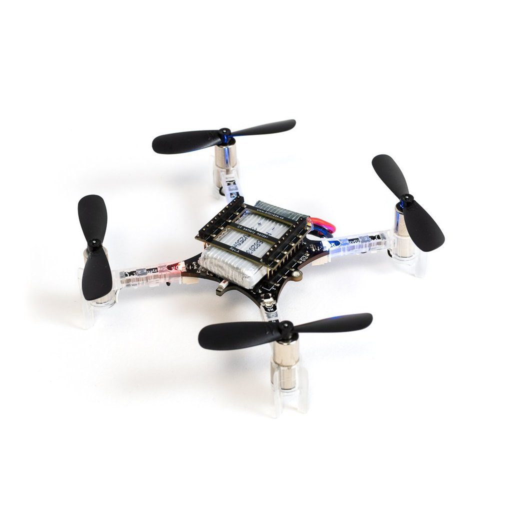
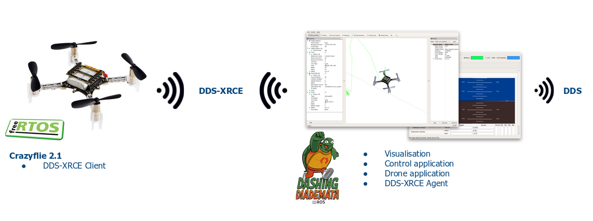

This demo is a proof concept, which aims to demostrate the versatility of the Micro-ROS project to be adapted to an already exciting product, with constrain memory size and respecting the original firmware. On this demostration we're going to work with the [Crazyflie 2.1 Drone](https://www.bitcraze.io/products/crazyflie-2-1/). This is a tiny and open-source drone which has the next characteristics:
- STM32F405 (Cortex-M4, 168MHz, 192kb SRAM, 1Mb flash)
- Radio and power management by nRF51822 MCU (Up to 1 Km of range)
- BMI088 IMU
- BMP388 barometric sensor
- 100 mAH battery which gives an autonomy of up to 7 minutes.
- Dimensions: 92x92x92 mm
- Takeof weight: 27g



The main challenge of this demo, was been able to fit Micro-ROS inside of the already existing firmware which with all the features active use around the 60% of the MCU RAM memory and X of the flash memory. Thanks to the modular design of micro-ROS and the versatile configuration system, is possible to fit micro-ROS full stack on this tiny device.

On the next points we will see the functionalities of this micro-ROS demo and how you can reproduce it.

## Required hardware:

* 1 x [Crazyflie 2.1](https://www.bitcraze.io/crazyflie-2-1/),
* 1 x [Crazyradio PA](https://www.bitcraze.io/crazyradio-pa/),
* 1 x [Flow deck v2](https://www.bitcraze.io/flow-deck-v2/),
* 1 x [Crazyflie-compatible remote controller](https://www.bitcraze.io/docs/crazyflie-clients-python/master/inputdevices/).

## Reproduce the demo
On the next points, we will see a set of steps that you need to follow to succeed on the demo reproduction.
(Note: Is necessary to install previously ROS2 Dashing, you can find instructions here: [ROS2 Dashing](https://index.ros.org/doc/ros2/Installation/Dashing/))
### Work Space set-up and configuration

To create the work space and set the proper configuration for this demo, you need to execute the next commands:

- Create work space folder and download the micro-ROS build system:
```bash
# Source ROS2 Dashing
source /opt/ros/$ROS_DISTRO/setup.bash

# Create work-space folder
mkdir uros_ws && cd uros_ws

# Download the micro-ROS build system
git clone -b $ROS_DISTRO https://github.com/micro-ROS/micro-ros-build.git src/micro-ros-build

# Download ros dependencies
rosdep update && rosdep install --from-path src --ignore-src -y

# Build and source the micro-ROS build system
colcon build

source install/local_setup.bash
```
- Set the Crazyflie proper configuration:
```bash
# Create specific Crazyflie freertos workspace
ros2 run micro_ros_setup create_firmware_ws.sh freertos crazyflie

# Set the application configuration
ros2 run micro_ros_setup configure_firmware.sh crazyflie_position_publisher
```

Now the firmware should be ready to be compile.

### Build the firmware

Type the next command:
```bash
ros2 run micro_ros_setup build_firmware.sh
```
If everything goes fine, it should return the next output:
```bash
Build for the CF2 platform!
Build 120:5142cacdde8b (2019.09 +120) CLEAN
Version extracted from git
   text	   data	    bss	    dec	    hex	filename
 263996	   4972	 111996	 380964	  5d024	cf2.elf

```

### Flash the device

You need to set the device on DFU mode. To active this mode, you need to do next steps:
- Disconnect the battery.
- Push the reset buttom of the drone.
- At the same time that you're pushing the buttom, connect the micro-USB cable to the PC.
- Continue pushing the reset buttom, the blue LED should start blinking.
- Wait on this position until LED blink frequency increase.

Now the device is on DFU mode. Now execute the next command to flash the firmware to the device:

```bash
ros2 run micro_ros_setup flash_firmware.sh
```
Now your drone is flashed and ready with micro-ROS. Disconnect the USB cable and connect again the battery. 

### Connect the drone to the host PC.

The first step is to set-up your PC, to do so, you need to follow the next steps:
```bash
# Download the micro-ROS_crazyflie_demo
git clone https://github.com/micro-ROS/micro-ROS_crazyflie_demo

# Install docker compose
sudo apt-get install docker-compose

# Execute xhost
xhost +

# Execute docker compose to build all the requiered work space
docker-compose up -d
```
This last step could take a while the first time that you execute it, but later on executions, it will execute almost inmediatly.

If everything goes fine, it should appear RVIZ and CrazyFlies Client. Each application, has the next utility:
- RVIZ: Shows an animation of the drone, drawing de flight trayectory on screen. This data are obtained from the ROS2 topic published by the drone.
- CrazyFlie Client: Shows the telemetry status of the drone, allows us to modify the configuration of the device and works as communication bridge between the CrazyFlie radio protocol and the micro-ROS network.

Once open it should look like this:
<!-- Add image of RVIZ and Crazyflie without connection-->

Push the reset buttom of the drone. The drone will perform an internal check status which if goes fine it should do the next:
- Move the propellers producing a "melody".
- Turning on statically two blue and one red light.
- Blinking the yellow LED.

Finally you need to do the next steps:
- Connect the USB radio dongle.
- Push the buttom scan on the Crazyflie Client.
- On the left menu it should appear an interface called ```` select it.
- Finally Push the buttom connect.

The part of the menu that you need to manipulate is highlited on the next image:


Now everything is ready and the Crazyflie Client should return the telemetry data and the RVIZ should start to show drone trajectory like on the bottom image:
<!--- Add Image with drone working properly-->

Finally, if you want to close this utilities properly, you need to execute the next command:
```bash
docker-compose down
```

## Demo functionality

Once everything is ready you can check on the ROS2 network the telemetry of the drone. On the next image, you see the available topics and how interact it with RVIZ.


On the other hand, on the next image you can see a simplify diagram of how is performed the communication path between the drone and the ROS2 network:



## Annex

Is possible to fly the drone at the same time that micro-ROS is running inside of it. To do so, you need to follow the next guide which explains how to connect a compatible controller to the host PC to fligth it.

[Crazyflies flight Controller](https://www.bitcraze.io/documentation/repository/crazyflie-clients-python/master/inputdevices/)
